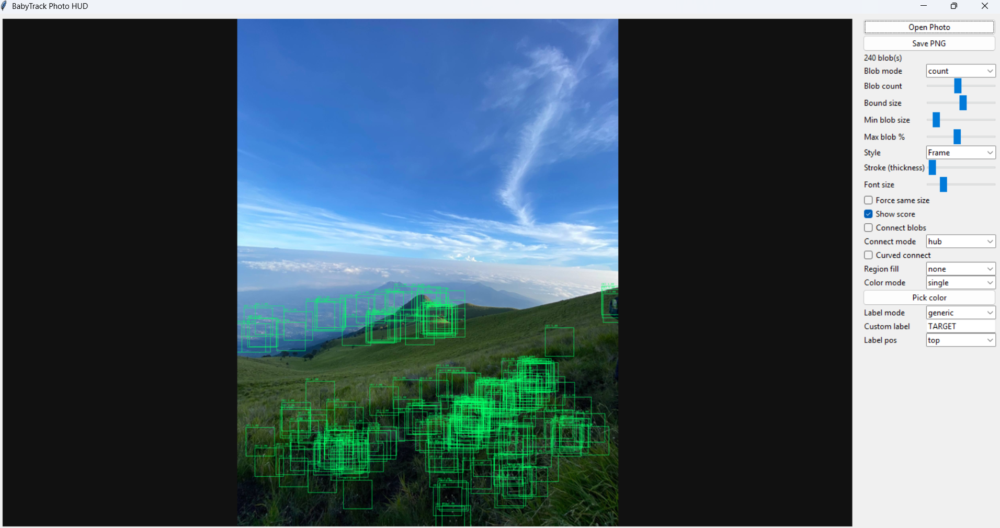

# BabyTrack Effect


A desktop app that turns a single photo into a sci-fi "tracking HUD" scene. It finds many
visual blobs in the image and overlays tracking boxes, labels, and connection lines on
them. Tune the count, shape, style, color, and effects, then export a full-resolution PNG.



## What it does

Load a photo, and the app detects high-contrast feature regions ("blobs") and draws a
tracking overlay on each one. The look is "random but specific": many boxes lock onto
real image features rather than recognized objects.

This is classical computer vision (OpenCV corner and contour detection), not AI. No model,
no training, no GPU. The same photo always gives the same result.

## Features

- Two detection modes: By Count (feature points, 16-512 boxes) and By Size (contour blobs)
- Blob filters: min size, and max size as a percent of the image (drops oversized boxes)
- Box shapes: rectangle, ellipse, diamond, hexagon, triangle, or a random mix from a chosen pool
- 30 overlay styles: 14 HUD (Frame, L-Frame, Scope, Grid, Glow, ...) and 16 filters
  (Invert, Thermal, Glitch, Pixel, CRT, X-Ray, ...) — filters follow the box shape
- Connection lines between blobs: hub, nearest, or mesh, straight or curved
- In-box region effects: gradient, invert, darken, brighten, tint, pixelate, scanline
- Color, label, font, and stroke thickness controls
- Loads JPG, PNG, BMP, WEBP, and HEIC/HEIF (iPhone photos)
- Maximized and fullscreen (F11) window with a responsive canvas
- Export to lossless full-resolution PNG (no compression added)

## Setup

```
python -m venv .venv
.venv\Scripts\python -m pip install -r requirements.txt
```

## Run

```
.venv\Scripts\python main.py
```

Always run with the venv Python so OpenCV and HEIC support are available.

1. Open Photo, pick any detailed image.
2. Tracking boxes scatter across detected blobs.
3. Adjust Blob mode and Blob count to control detection.
4. Pick a Style, Box shape, and tune stroke, color, label, connections, and region fill.
5. Save PNG.

## Tests

```
.venv\Scripts\python -m pytest
```

## Project layout

```
babytrack/
  blobs.py        OpenCV blob detection (by-count, by-size)
  renderers.py    30 overlay styles + box shapes in a registry
  connections.py  blob-to-blob lines (hub/nearest/mesh, straight/curved)
  region_fx.py    in-box effects (gradient, invert, ...)
  compositor.py   layers connections, region effects, and outlines
  export.py       PNG save
  app.py          Tkinter GUI
main.py           entry point
```

## License

Personal project.
